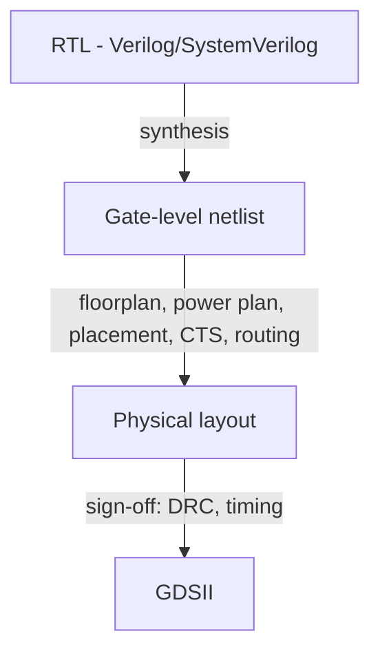

`vlsi` `eda` `physical-design`

RTL-to-GDS is the full chip physical-design flow that turns a Verilog/SystemVerilog register-transfer-level (RTL) description into a manufacturable GDSII layout:

Sign-off quality is judged on DRC cleanliness and timing slack (WNS/TNS on setup and hold) — a "clean" tapeout has zero violations on both.

Related:

→ [[projects/vlsi-16bit-square-rooter|16-bit Binary Square Rooter]] — full RTL-to-GDS run in 45 nm GPDK045, DRC-clean, positive WNS on setup and hold
→ [[projects/vlsi-pd-handbook|Physical Design Optimization Handbook]] — full reference documentation of this flow
