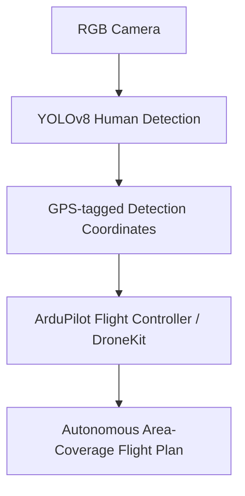

`computer-vision` `ai` `uav` · Sep – Dec 2024 · **Status: Complete**

[GitHub →](https://github.com/JubayerONROB/autonomous-rescue-drone)

## Description

An AI-powered drone for search and rescue, built to locate survivors in disaster areas where manual search is slow or dangerous.

## Technical stack

- Python, YOLOv8, OpenCV
- DroneKit, ArduPilot
- GPS-based flight control

## Architecture

## Key contributions

- Real-time human detection using RGB cameras and OpenCV.
- GPS-based autonomous flight control for structured area coverage, so the drone systematically sweeps a search zone rather than flying ad hoc.

## Related

[[projects/ultrasonic-obstacle-mapping-bot|Ultrasonic Obstacle Mapping Bot]] — another autonomous-navigation project, ground-based instead of aerial.
