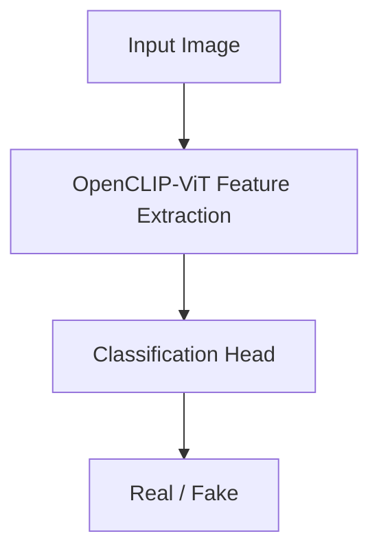

`openclip` `vit` `pytorch` · Oct 2024 – Jan 2025 · **Status: Complete**

## Description

A deepfake detection model built on OpenCLIP-ViT, achieving 98% training and 97% validation accuracy. Tested on the IEEE SP Cup 2025 dataset with strict mini-batch training under significant class imbalance.

## Technical stack

- OpenCLIP-ViT, PyTorch

## Architecture

## Results

| Metric | Result |
|---|---|
| Training accuracy | 98% |
| Validation accuracy | 97% |
| Dataset | IEEE SP Cup 2025 — 43k real, 219k fake images |

## Related

[[projects/brain-tumor-detection-mri|Brain Tumor Detection on MRI Images]] — another applied computer-vision/classification project.
