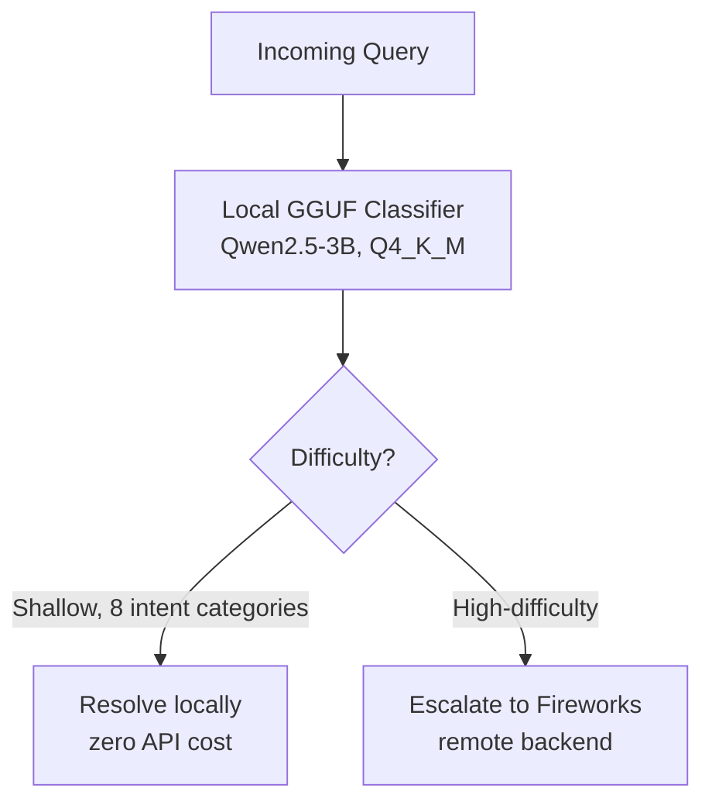

`llm-routing` `docker` `python` · July 2026 · **Status: Complete (AMD Hackathon ACT II, Track 1)**

[GitHub →](https://github.com/JubayerONROB/vinci-monsoon)

## Description

A token-efficient LLM routing agent built for AMD Hackathon ACT II (Track 1). A grammar-constrained local GGUF classifier resolves shallow tasks at zero API cost, escalating only high-difficulty queries across 8 intent categories to a Fireworks remote backend.

## Technical stack

- Qwen2.5-3B (GGUF, Q4_K_M quantization) — local classifier
- Fireworks API — remote backend for hard queries
- Docker — CPU-only inference pipeline
- pytest — offline evaluation harness

## Architecture

## Experiment log

**Hypothesis:** a small, grammar-constrained local classifier can resolve most incoming queries without ever calling a remote LLM, cutting API cost with no correctness regression on the harder queries that still get escalated.

**Setup:** 8 intent categories, CPU-only grading VM (4 GB RAM, no GPU, linux/amd64), 25s per-request timeout, offline pytest harness enforcing zero hardcoded values so results reflect the classifier's real output rather than fixture data.

**Result:** the classifier reliably separated shallow from high-difficulty queries under the offline harness, escalating only the latter to the Fireworks backend and holding to the CPU/memory/timeout budget of the grading VM throughout.

## Key contributions

- Grammar-constrained local classification keeps routing decisions structured and cheap.
- Dockerized the full inference pipeline for a constrained CPU-only grading VM (4 GB RAM, no GPU, linux/amd64), with env-driven model selection, a 25s per-request timeout, and graceful local fallback.
- Built an offline pytest evaluation harness ensuring zero hardcoded values — the whole pipeline is verifiably driven by real classifier output.

## Related

[[research/proactive-conversation-assistant|Proactive Conversation Assistant]] — same two-stage, cost-aware architectural pattern (cheap fast path, expensive path only when needed).
