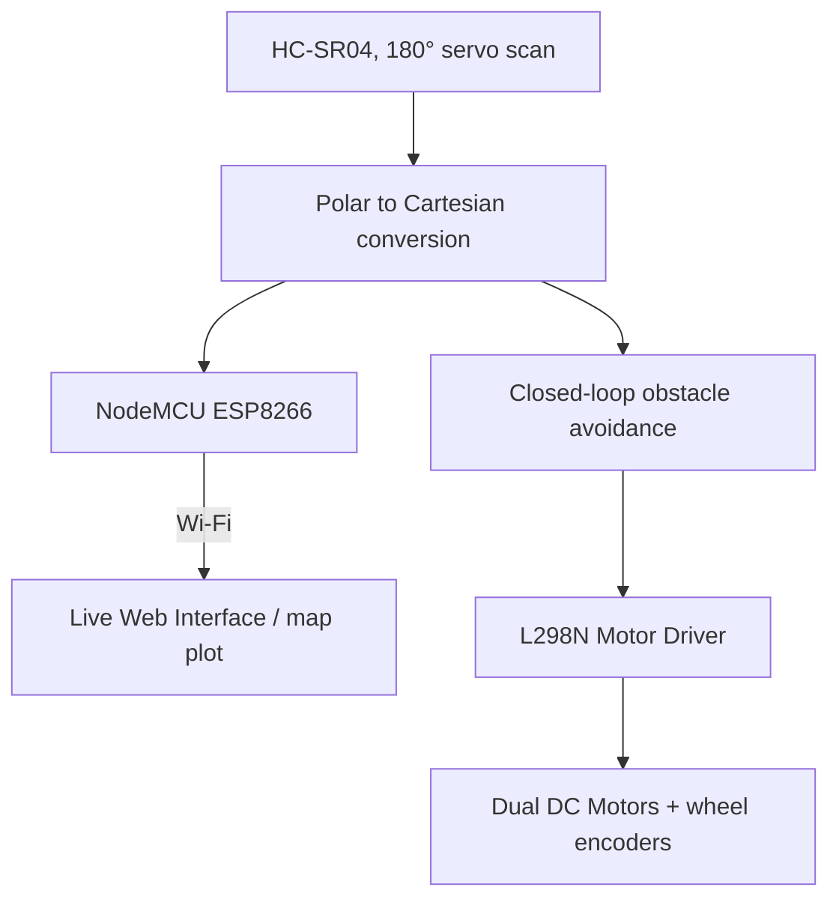

`embedded-systems` `robotics` `iot` · August 2025 · **Status: Complete**

[GitHub →](https://github.com/JubayerONROB/Ultrasonic-Obstacle-Mapping-Bot)

## Description

A low-cost (under $50) autonomous mapping robot. An HC-SR04 ultrasonic sensor mounted on a servo performs 180° scans while a NodeMCU ESP8266 streams the resulting indoor obstacle map to a live web interface.

## Technical stack

- HC-SR04 ultrasonic sensor + servo
- NodeMCU ESP8266 (Wi-Fi streaming to web UI)
- L298N motor driver, dual DC gear motors, wheel encoders

## Architecture

## Key contributions

- Polar-to-Cartesian coordinate conversion for real-time map plotting.
- Closed-loop obstacle avoidance driven directly by the live sensor scan, with wheel encoders providing odometry feedback.

## Related

[[projects/autonomous-rescue-drone|Autonomous Rescue Drone]] — shares the autonomous-navigation theme, aerial vs. ground-based.
