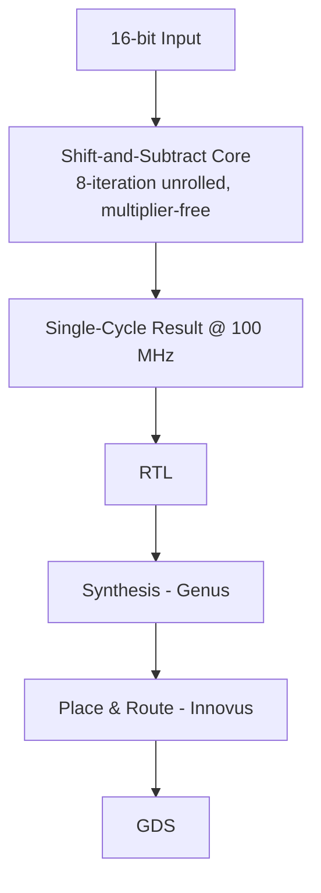

`vlsi` `verilog` `systemverilog` `cadence-eda` · Jan – Apr 2026 · **Status: Complete (EEE468, BUET)**

[GitHub →](https://github.com/JubayerONROB/vlsi-sqrt-16bit)

## Description

A multiplier-free 16-bit integer square-root module in Verilog, using an 8-iteration unrolled shift-and-subtract algorithm — achieving single-cycle throughput at 100 MHz with 100% functional coverage.

## Technical stack

- Verilog, SystemVerilog (directed, layered-SV, and covergroup testbenches)
- Cadence Genus (synthesis), Cadence Innovus (place & route)
- 45 nm GPDK045 process

## Architecture

## Results

| Metric | Result |
|---|---|
| Functional coverage | 100% (directed + layered-SV + covergroup) |
| Clock frequency | 100 MHz, single-cycle throughput |
| Cell count | 197 |
| Area | 347 sq. µm |
| Setup WNS | +0.264 ns |
| Hold WNS | +0.014 ns |
| DRC | Clean, zero timing violations |

## Related

[[projects/vlsi-pd-handbook|Physical Design Optimization Handbook]] — broader reference material covering the same RTL-to-GDS flow used here.
