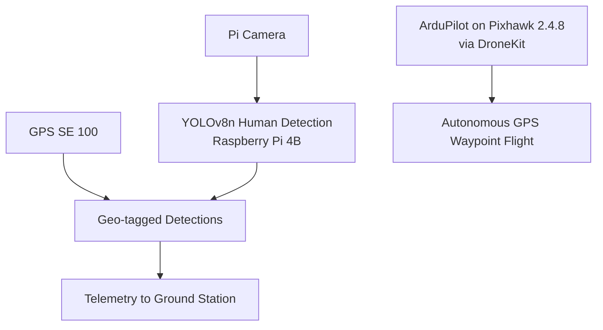

`computer-vision` `ai` `uav` · Sep – Dec 2024 · **Status: Complete**

[GitHub →](https://github.com/JubayerONROB/autonomous-rescue-drone)

## Overview

An AI-powered drone for search and rescue, built to locate survivors in disaster areas where manual search is slow or dangerous.

## Problem

Manual visual search over a disaster area is slow, and human searchers can't safely or quickly cover large or hazardous zones. A drone that autonomously scans an area and flags likely survivors gives responders a faster first pass.

## Approach

Run real-time human detection (YOLOv8n) on the camera feed of a Raspberry Pi 4B mounted on the drone, tag each detection with the drone's GPS position, and send the geo-tagged coordinates to the ground team over telemetry. In parallel, a Pixhawk flight controller running ArduPilot flies a GPS-waypoint mission (built and uploaded with DroneKit), so the drone follows a planned search pattern instead of relying on a manual pilot.

## System architecture

## Tech stack

- Python, YOLOv8n (Ultralytics), OpenCV, PyTorch
- DroneKit, ArduPilot (ArduCopter), Mission Planner / QGroundControl
- Pixhawk 2.4.8 flight controller, Raspberry Pi 4B, Pi Camera Module 2, GPS SE 100
- 915 MHz telemetry, FlySky FS-i6 transmitter

## Results

- Real-time human detection on the Raspberry Pi 4B at about 5 FPS.
- YOLOv8n trained for 50 epochs on a Roboflow SAR dataset (3,000 training and 1,000 test images): precision 0.717, recall 0.647, mAP@50 0.689, mAP@50-95 0.401.
- GPS-waypoint autonomous flight through ArduPilot, with detections geo-tagged and sent to the ground.

## Media

<iframe src="https://www.youtube.com/embed/r3i4aEx2VTE" title="Autonomous Rescue Drone demo" loading="lazy" allowfullscreen></iframe>

*Project demo. [Watch on YouTube →](https://youtu.be/r3i4aEx2VTE)*

*Project poster: motivation, hardware and firmware, human-detection results (precision 0.717, recall 0.647, mAP50 0.689) and future work. [Download the poster as PDF →](/attachments/projects/autonomous-rescue-drone/Drone_poster.pdf)*

## Challenges

Not documented yet.

## What I learned

Not documented yet.

## Future work

Power efficiency (solar-assist charging), a stronger detection model with thermal and night-vision input, faster data links (5G), wind compensation for flight stability, LiDAR or ultrasonic obstacle avoidance, and extended field testing in varied disaster environments.

## Related

[[work/projects/ultrasonic-obstacle-mapping-bot|Ultrasonic Obstacle Mapping Bot]] — another autonomous-navigation project, ground-based instead of aerial.
