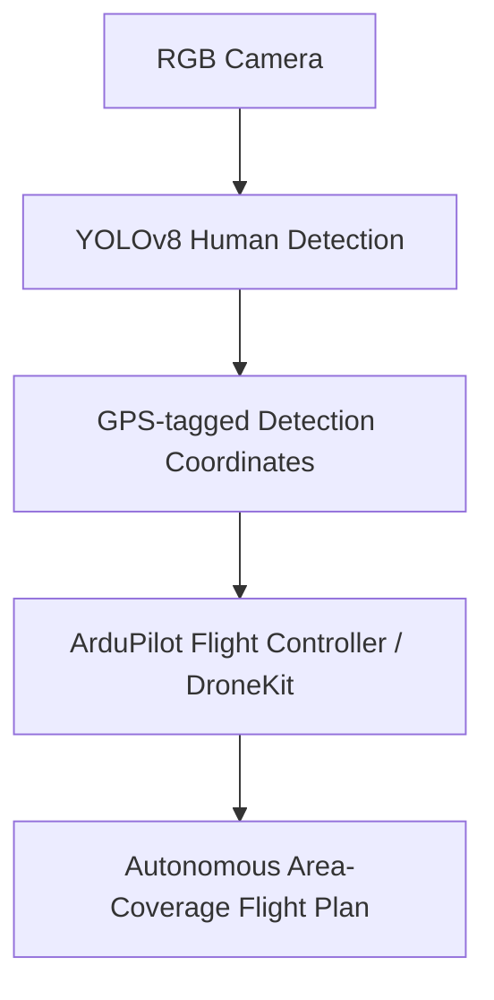

`computer-vision` `ai` `uav` · Sep – Dec 2024 · **Status: Complete**

[GitHub →](https://github.com/JubayerONROB/autonomous-rescue-drone)

## Overview

An AI-powered drone for search and rescue, built to locate survivors in disaster areas where manual search is slow or dangerous.

## Problem

Manual visual search over a disaster area is slow, and human searchers can't safely or quickly cover large or hazardous zones. A drone that autonomously scans an area and flags likely survivors gives responders a faster first pass.

## Approach

Run real-time human detection on the drone's onboard camera feed, tag detections with GPS coordinates, and hand those coordinates to the flight controller so the drone can fly a structured, full-coverage search pattern rather than relying on a manual pilot to sweep the area.

## System architecture

## Tech stack

- Python, YOLOv8, OpenCV
- DroneKit, ArduPilot
- GPS-based flight control

## Results

- Real-time human detection using RGB cameras and OpenCV.
- GPS-based autonomous flight control for structured area coverage, so the drone systematically sweeps a search zone rather than flying ad hoc.

## Challenges

Not documented yet.

## What I learned

Not documented yet.

## Future work

Testing against varied terrain and lighting conditions, and extending detection to handle partially-occluded or thermal-camera input for low-visibility search scenarios.

## Related

[[work/projects/ultrasonic-obstacle-mapping-bot|Ultrasonic Obstacle Mapping Bot]] — another autonomous-navigation project, ground-based instead of aerial.
[[notes/yolo|YOLO]] · [[notes/pixhawk-communication|Pixhawk Communication]]
