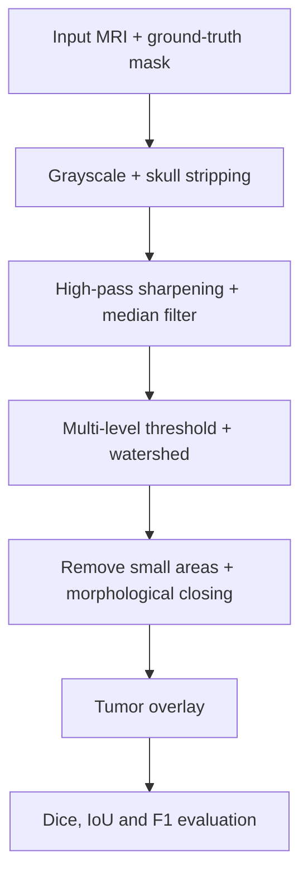

`digital-image-processing` `matlab` · March 2024 · **Status: Complete**

[GitHub →](https://github.com/DarkJ0Y/brianTumorDetectWatershed)

## Overview

A group project from the signal processing coursework at BUET: a computer-aided diagnosis (CAD) system in MATLAB that finds brain tumors in MRI images using classical image processing only, with no machine learning. Results are scored against ground-truth tumor masks.

## Problem

Raw clinical MRI scans are often noisy and low-contrast, which makes manual tumor identification slower and more error-prone. Cleaning up the image before detection improves both.

## Approach

The pipeline has five stages. The input MRI and its ground-truth mask are chosen through a file dialog. The image is converted to grayscale and skull-stripped using thresholding, hole filling and morphological operations. It is then sharpened with a Gaussian high-pass filter and smoothed with a median filter. Multi-level thresholding and watershed segmentation (applied to the negative distance transform of the binary image) split the image into regions. Finally, small areas are removed, a morphological closing with a large disk-shaped structuring element fills gaps, and the resulting tumor outline is overlaid on the original scan for comparison with the ground truth.

## System architecture

## Tech stack

- MATLAB, Image Processing Toolbox (multithresh, watershed, morphological operations)
- Dice coefficient, IoU and F1 score for evaluation

## Results

Averaged over the evaluation set:

| Metric | Mean | Standard deviation |
|---|---|---|
| Dice coefficient | 0.873 | 0.211 |
| IoU score | 0.819 | 0.243 |
| F1 score | 0.904 | 0.134 |

The report compares this classical method with published learning-based approaches that, per the report, used the same dataset. UNet++ with MobileNetV2 reaches a Dice of 0.925 and UNet Plus reaches 0.906, so the classical pipeline is respectable but behind the machine-learning and deep-learning models.

## Media

*From the raw MRI to the final tumor mask: grayscale, skull stripping, median filtering, thresholding, watershed segmentation and morphological closing.*

*The detected tumor (left) overlaid next to the original ground-truth mask (right) for one test image.*

*Frequency distribution of the Dice, IoU and F1 scores across the evaluation set.*

[Read the full report (PDF, 5 pages) →](/attachments/projects/brain-tumor-detection-mri/Brain-Tumor-Detection-on-MRI-Report.pdf)
## Challenges

The thresholds were tuned by trial and error on roughly 150 images, and the large standard deviations show that some scans segment far better than others.

## What I learned

Not documented yet.

## Future work

The report concludes that machine-learning and deep-learning models give higher segmentation accuracy, so a natural next step is replacing the hand-tuned classical stages with a learned segmentation model.

## Related

[[work/projects/deepfake-detection-clip-vit|Deepfake Detection using CLIP-ViT]] — another applied computer-vision/classification project.
