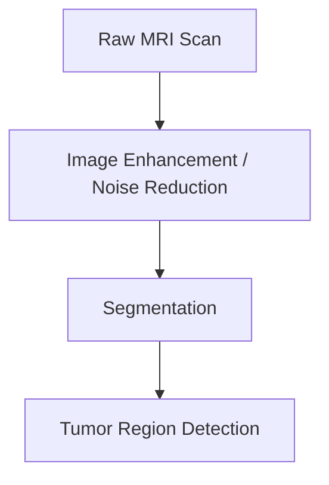

`digital-image-processing` `matlab` · March 2024 · **Status: Complete**

[GitHub →](https://github.com/DarkJ0Y/brianTumorDetectWatershed)

## Overview

A CAD (computer-aided diagnosis) system for automated brain tumor detection on clinical MRI data, using advanced image processing techniques to improve MRI clarity before detection.

## Problem

Raw clinical MRI scans are often noisy and low-contrast, which makes manual tumor identification slower and more error-prone. Cleaning up the image before detection improves both.

## Approach

Apply image enhancement and noise-reduction techniques to the raw MRI scan first, then segment the cleaned image to isolate candidate tumor regions.

## System architecture

## Tech stack

- MATLAB, digital image processing pipelines

## Results

Achieved high sensitivity and specificity in tumor detection on clinical MRI data.

## Challenges

Not documented yet.

## What I learned

Not documented yet.

## Future work

Not documented yet.

## Related

[[work/projects/deepfake-detection-clip-vit|Deepfake Detection using CLIP-ViT]] — another applied computer-vision/classification project.
