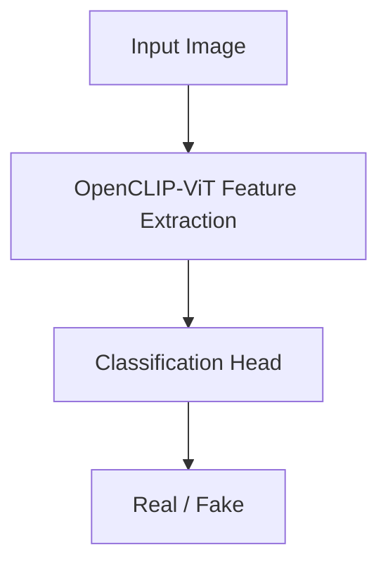

`openclip` `vit` `pytorch` · Oct 2024 – Jan 2025 · **Status: Complete**

## Overview

A deepfake detection model built on OpenCLIP-ViT, achieving 98% training and 97% validation accuracy. Tested on the IEEE SP Cup 2025 dataset with strict mini-batch training under significant class imbalance.

## Problem

Distinguishing real from AI-generated ("deepfake") images is an adversarial, fast-moving problem — generators keep improving, so a detector needs features that generalize rather than overfitting to artifacts of one specific generator.

## Approach

Use OpenCLIP-ViT's pretrained image representations, which were learned from a huge and diverse image-text corpus rather than from deepfake data specifically, as the feature extractor, then train a classification head on top for the real-vs-fake decision. Mini-batch training had to be handled carefully given the dataset's heavy class imbalance (43k real vs. 219k fake images).

## System architecture

## Tech stack

- OpenCLIP-ViT, PyTorch

## Experiments

No standalone lab-notebook entry yet for this project — see [[work/experiments/index|Experiments]] for the ones that exist.

## Results

| Metric | Result |
|---|---|
| Training accuracy | 98% |
| Validation accuracy | 97% |
| Dataset | IEEE SP Cup 2025 — 43k real, 219k fake images |

## Challenges

The dataset's roughly 5:1 fake-to-real imbalance meant naive mini-batch sampling would bias the model toward predicting "fake" by default — this had to be accounted for directly in the training/mini-batch strategy rather than ignored.

## What I learned

Not documented yet.

## Future work

Not documented yet.

## Related

[[work/projects/brain-tumor-detection-mri|Brain Tumor Detection on MRI Images]] — another applied computer-vision/classification project.
[[knowledge/ai-ml/clip|CLIP]] · [[knowledge/ai-ml/vision-transformers|Vision Transformers]]
