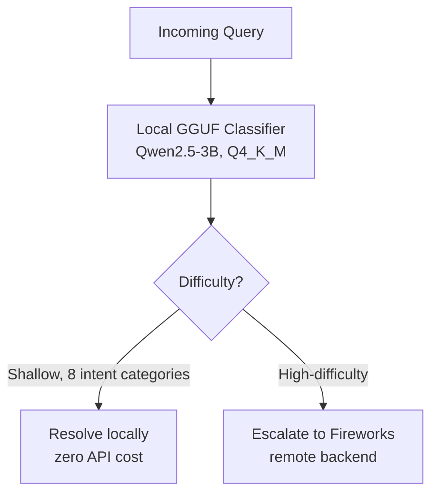

`llm-routing` `docker` `python` · July 2026 · **Status: Complete (AMD Hackathon ACT II, Track 1)**

[GitHub →](https://github.com/JubayerONROB/vinci-monsoon)

## Overview

A token-efficient LLM routing agent built for AMD Hackathon ACT II (Track 1). A grammar-constrained local GGUF classifier resolves shallow tasks at zero API cost, escalating only high-difficulty queries across 8 intent categories to a Fireworks remote backend.

## Problem

Calling a large remote LLM for every query is expensive and slow, even though most real queries are easy enough for a much smaller model to handle correctly. The hackathon track scored on task accuracy *and* token spend, so blindly routing everything to the strongest model was never going to win.

## Approach

Put a small local classifier in front of the remote LLM: a grammar-constrained Qwen2.5-3B (GGUF, quantized) decides, per query, whether it falls into one of 8 shallow intent categories it can resolve directly, or whether it needs escalation to a larger remote model. The whole thing had to run inside a hard hardware budget — a CPU-only grading VM with 4 GB RAM and no GPU — so the local classifier's own footprint mattered as much as its accuracy.

## System architecture

## Tech stack

- Qwen2.5-3B (GGUF, Q4_K_M quantization) — local classifier
- Fireworks API — remote backend for hard queries
- Docker — CPU-only inference pipeline
- pytest — offline evaluation harness

## Experiments

Full hypothesis / method / result writeup: [[work/experiments/exp-002-hybrid-router-local-classifier|EXP-002]]

## Results

- Grammar-constrained local classification keeps routing decisions structured and cheap.
- Dockerized the full inference pipeline for a constrained CPU-only grading VM (4 GB RAM, no GPU, linux/amd64), with env-driven model selection, a 25s per-request timeout, and graceful local fallback.
- Built an offline pytest evaluation harness ensuring zero hardcoded values — the whole pipeline is verifiably driven by real classifier output.

## Challenges

The hard constraint was the grading environment itself: 4 GB RAM, no GPU, linux/amd64 only, with a 25s per-request timeout. That ruled out anything but a heavily quantized local model, and required a graceful local fallback path for when the classifier or remote backend was unavailable.

## What I learned

Not documented yet.

## Future work

Not documented yet.

## Related

[[work/research/proactive-conversation-assistant|Proactive Conversation Assistant]] — same two-stage, cost-aware architectural pattern (cheap fast path, expensive path only when needed).
[[notes/llm-routing|LLM Routing]] · [[notes/model-optimization|Model Optimization]]
