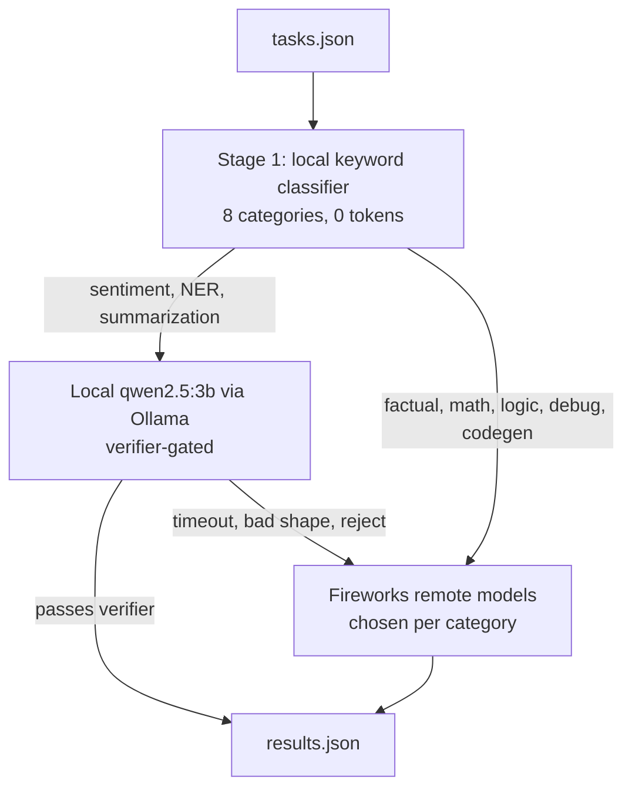

`llm-routing` `docker` `python` · July 2026 · **Status: Complete (AMD Hackathon ACT II, Track 1)**

[GitHub →](https://github.com/JubayerONROB/vinci-monsoon)

## Overview

A token-efficient LLM routing agent built for AMD Hackathon ACT II (Track 1). It classifies each task into one of 8 categories locally, answers sentiment, entity-extraction and summarization tasks with a local Qwen2.5-3B model at zero scored tokens, and sends everything else to Fireworks models.

## Problem

Calling a large remote LLM for every query is expensive, even though some tasks are easy enough for a small local model. The track scored in two stages: an accuracy gate (at least 16 of 19 tasks correct), then ranking by total Fireworks tokens spent, fewest wins. Saving tokens only counts if the answers stay correct.

## Approach

A deterministic keyword classifier (no tokens, instant) assigns each task to one of 8 categories: factual, math, sentiment, summarization, NER, code debugging, logical reasoning or code generation. Sentiment, NER and summarization go to a local Ollama sidecar running qwen2.5:3b, which is baked into the image. Each local answer must pass a category-specific verifier, and any timeout, malformed output or failed check escalates the task to the remote lane instead of shipping a bad answer. All other categories go to Fireworks models chosen per category, resolved at runtime from the allowed-models list. Tasks run in parallel under one global deadline.

## System architecture

## Tech stack

- Python, with parallel dispatch through a thread pool
- Ollama sidecar with qwen2.5:3b (local lane)
- Fireworks API (remote lane)
- Docker, CPU-only linux/amd64 image of about 1.9 GB compressed
- pytest and an offline evaluation harness

## Results

- Best graded run: 18 of 19 tasks correct (94.7%), clearing the 16/19 accuracy gate, at about 6,276 Fireworks tokens.
- Local answers are verified before they ship, so the local lane can save tokens but never trade away accuracy.
- Crash-safe output: results are written once from a single path that also runs on failure, so a run always ends with a valid results file and no blank answers.
- Offline test suite (schema, verifiers, model resolution, output integrity, lane isolation) kept green before every submission.

## Challenges

Timeouts dominated the work. Early versions ran a local GGUF model and kept hitting the time limit, and the lesson from the engineering log was that the local model's load and inference latency, not image size, was the real risk. The design moved to an all-remote phase and later reintroduced the local lane as a verifier-gated Ollama sidecar with fail-open escalation. A per-request timeout of 12 seconds and a global deadline keep every run bounded. A token-reduction pass that re-routed accuracy-sensitive categories once cost two gate points (16 of 19), a reminder that the accuracy gate comes first.

## What I learned

Not documented yet.

## Future work

Not documented yet.

## Related

[[work/research/proactive-conversation-assistant|Proactive Conversation Assistant]] — same two-stage, cost-aware architectural pattern (cheap fast path, expensive path only when needed).
