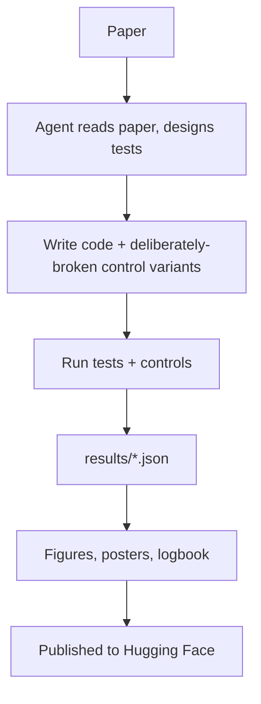

`machine-learning` `reproducibility` `ai-safety` `llm-evaluation` · **Status: Complete**

[GitHub →](https://github.com/JubayerONROB/icml2026-agent-repro)

## Overview

Eight end-to-end reproductions of ICML 2026 papers, run as an autonomous agent pipeline (Claude Code / Opus 5) that read each paper, designed tests, wrote code, ran audits, generated figures and posters, and published logbooks to Hugging Face.

## Problem

Published results aren't always reproducible from the paper and released code alone — and an agent-driven reproduction pipeline needs its own tests to be trustworthy, not just its target claims.

## Approach

Build a pipeline where an autonomous agent reads each paper, designs tests, writes code, and audits its own results, with "controls that must FAIL" — deliberately broken variants included alongside each real test to prove the tests are actually discriminating rather than passing by default. All results flow through a single `results/*.json` file so figures and prose stay synchronized with the underlying measurements.

## System architecture

## Tech stack

- Claude Code (Opus 5) as the autonomous agent
- Hugging Face — logbook publishing

## Results

**Paper #8565 — "A Coin Flip for Safety: LLM Judges Fail to Reliably Measure Adversarial Robustness"**
5 verified claims, 1 partial. The paper's central claim survives with the released data; Figure 3 reproduced exactly, matching to the integer.

**Paper #15191 — "Who Said Neural Networks Aren't Linear?"**
5 verified claims — plus a bug found in the authors' released code: a nesting error in the Runge-Kutta branch silently demoted it to first-order accuracy. Fixing it restored agreement between one-step and multi-step methods to 80 dB PSNR.

**Paper #10372 — "Ski Rental with Distributional Predictions of Unknown Quality"**
5 verified claims. A pure theory paper, audited exactly rather than benchmarked.

**Paper #29413 — "Measuring Agents in Production"**
3 exact, 1 as-reported, 1 partial. The raw data was never released, so it was recovered from the figure PDFs (160 labels across 39 figures, all arithmetically consistent).

**Paper #26468 — "A Tight Theory of Error Feedback Algorithms in Distributed Optimization"**
6 verified claims, with 117 semidefinite programs re-solved to check tightness.

**Paper #8097 — "Attention's Forward Pass and Frank-Wolfe"**
5 verified claims; the central identity holds to 1e-15.

**Paper #448 — "On Structured State Space Duality"**
5 verified claims, running the paper's constructive proof.

**Paper #2 — "Reward-Free Alignment for Conflicting Objectives"**
2 verified, 1 partial and 2 not reproduced for lack of a GPU. The released dataset turned out to be empty.

## Posters

Each reproduction ends in a one-page poster. The full logbook for each paper is on Hugging Face.

*A Coin Flip for Safety: LLM Judges Fail to Reliably Measure Adversarial Robustness. [Logbook on Hugging Face →](https://huggingface.co/spaces/xubayer/repro-a-coin-flip-for-safety-llm-judges-fail-to-measure-adversarial-robustness)*

*Who Said Neural Networks Aren't Linear?. [Logbook on Hugging Face →](https://huggingface.co/spaces/xubayer/repro-who-said-neural-networks-aren-t-linear)*

*Ski Rental with Distributional Predictions of Unknown Quality. [Logbook on Hugging Face →](https://huggingface.co/spaces/xubayer/repro-ski-rental-with-distributional-predictions-of-unknown-quality)*

*Measuring Agents in Production. [Logbook on Hugging Face →](https://huggingface.co/spaces/xubayer/repro-measuring-agents-in-production)*

*A Tight Theory of Error Feedback Algorithms in Distributed Optimization. [Logbook on Hugging Face →](https://huggingface.co/spaces/xubayer/repro-a-tight-theory-of-error-feedback-algorithms-in-distributed-optimization)*

*Attention's Forward Pass and Frank-Wolfe. [Logbook on Hugging Face →](https://huggingface.co/spaces/xubayer/repro-attention-s-forward-pass-and-frank-wolfe)*

*On Structured State Space Duality. [Logbook on Hugging Face →](https://huggingface.co/spaces/xubayer/repro-on-structured-state-space-duality)*

*Reward-Free Alignment for Conflicting Objectives. [Logbook on Hugging Face →](https://huggingface.co/spaces/xubayer/repro-reward-free-alignment-for-conflicting-objectives)*

## Challenges

Verifying claims across very different paper types (pure theory, GPU-heavy empirical work, surveys, SDP-based tightness proofs) meant no single verification method worked for all eight — each needed its own audit strategy rather than one reusable test harness.

## What I learned

Not documented yet.

## Future work

Not documented yet.

## Related

[[work/research/proactive-conversation-assistant|Proactive Conversation Assistant]] — shares an evaluation-rigor mindset: verify claims against real measurements rather than assuming them.
