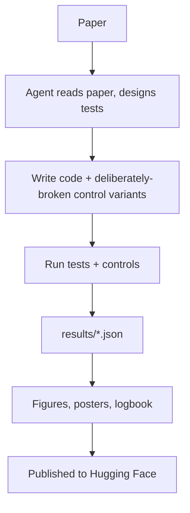

`machine-learning` `reproducibility` `ai-safety` `llm-evaluation` · **Status: Complete**

[GitHub →](https://github.com/JubayerONROB/icml2026-agent-repro)

## Overview

Eight end-to-end reproductions of ICML 2026 papers, run as an autonomous agent pipeline (Claude Code / Opus 5) that read each paper, designed tests, wrote code, ran audits, generated figures and posters, and published logbooks to Hugging Face.

## Problem

Published results aren't always reproducible from the paper and released code alone — and an agent-driven reproduction pipeline needs its own tests to be trustworthy, not just its target claims.

## Approach

Build a pipeline where an autonomous agent reads each paper, designs tests, writes code, and audits its own results, with "controls that must FAIL" — deliberately broken variants included alongside each real test to prove the tests are actually discriminating rather than passing by default. All results flow through a single `results/*.json` file so figures and prose stay synchronized with the underlying measurements.

## System architecture

## Tech stack

- Claude Code (Opus 5) as the autonomous agent
- Hugging Face — logbook publishing

## Experiments

No standalone notebook entry yet for this project — see [[work/experiments/index|Experiments]] for the ones that exist.

## Results

**Paper #8565 — "A Coin Flip for Safety: LLM Judges Fail to Reliably Measure Adversarial Robustness"**
5 verified claims, 1 partial. The paper's central claim survives with the released data; Figure 3 reproduced exactly, matching to the integer.

**Paper #15191 — "Who Said Neural Networks Aren't Linear?"**
5 verified claims — plus a bug found in the authors' released code: a nesting error in the Runge-Kutta branch silently demoted it to first-order accuracy. Fixing it restored agreement between one-step and multi-step methods to 80 dB PSNR.

The remaining six reproductions span pure theory papers (audited mathematically), GPU-heavy papers, survey papers (data recovered from PDF figures), and semidefinite-programming tightness verification.

## Challenges

Verifying claims across very different paper types (pure theory, GPU-heavy empirical work, surveys, SDP-based tightness proofs) meant no single verification method worked for all eight — each needed its own audit strategy rather than one reusable test harness.

## What I learned

Not documented yet.

## Future work

Not documented yet.

## Related

[[work/research/proactive-conversation-assistant|Proactive Conversation Assistant]] — shares an evaluation-rigor mindset: verify claims against real measurements rather than assuming them.
