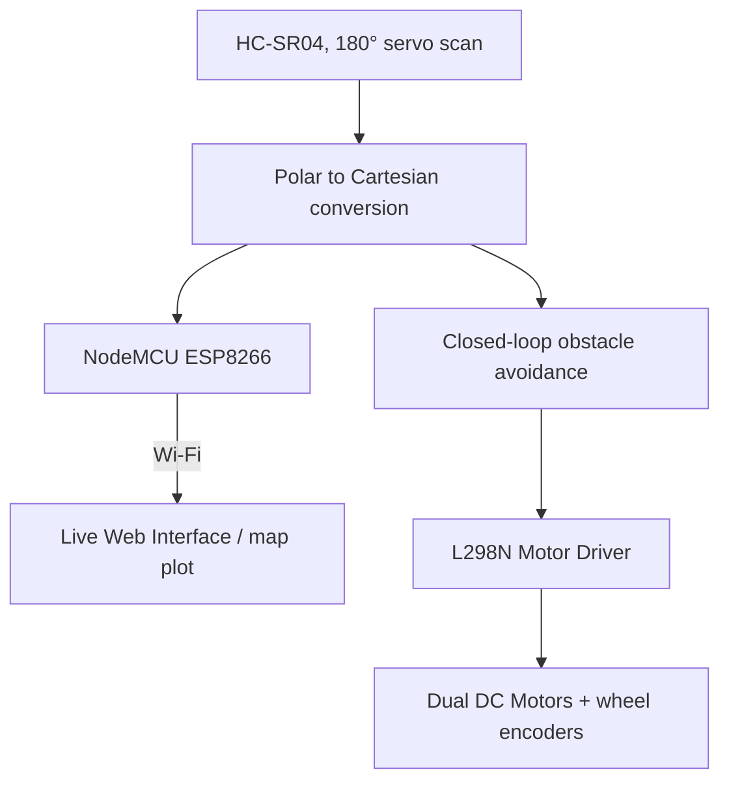

`embedded-systems` `robotics` `iot` · August 2025 · **Status: Complete**

[GitHub →](https://github.com/JubayerONROB/Ultrasonic-Obstacle-Mapping-Bot)

## Overview

A low-cost (under $50) autonomous mapping robot. An HC-SR04 ultrasonic sensor mounted on a servo performs 180° scans while a NodeMCU ESP8266 streams the resulting indoor obstacle map to a live web interface.

## Problem

Indoor obstacle mapping usually needs LiDAR or depth cameras that cost far more than a hobbyist budget allows. The goal was a working obstacle map and closed-loop avoidance for well under $50 in parts.

## Approach

A single ultrasonic sensor on a servo sweeps 180° per cycle instead of using an array of fixed sensors, trading scan speed for a large cost reduction. Wheel encoders track the bot's position, and each polar reading (angle, distance) is converted to Cartesian obstacle points on the map. The ESP8266 runs its own Wi-Fi access point and serves a browser dashboard that receives the sensor values, robot position and mapped points as JSON, while the same distance readings drive obstacle avoidance on the bot itself.

## System architecture

## Tech stack

- HC-SR04 ultrasonic sensor on an SG90 servo
- NodeMCU ESP8266 (Wi-Fi access point, web dashboard, JSON data)
- L298N motor driver, two DC gear motors, two wheel encoders, 7.4 V Li-ion battery

## Results

- Polar-to-Cartesian coordinate conversion for real-time map plotting.
- Closed-loop obstacle avoidance driven directly by the live sensor scan, with wheel encoders providing odometry feedback.
- Total hardware cost held under $50.

## Media

*The finished prototype (left) and the live control panel it serves over its own Wi-Fi access point (right), mapping obstacles as it drives.*

*How the ultrasonic sensor and servo, motor driver, wheel encoders and Wi-Fi module work together.*

*Odometry from the wheel encoders plus each sonar reading become global obstacle points that are plotted in real time.*

*The ESP8266 starts a local hotspot, serves the dashboard, and sends sensor values and mapped points to the browser as JSON.*

*The scanning state machine (left) and the movement state machine (right) that drive avoidance.*

## Challenges

Not documented yet.

## What I learned

Not documented yet.

## Future work

Extending from a single rotating sensor to a small sensor array or SLAM-style pose tracking, so the bot can localize itself instead of mapping from a fixed position.

## Related

[[work/projects/autonomous-rescue-drone|Autonomous Rescue Drone]] — shares the autonomous-navigation theme, aerial vs. ground-based.
