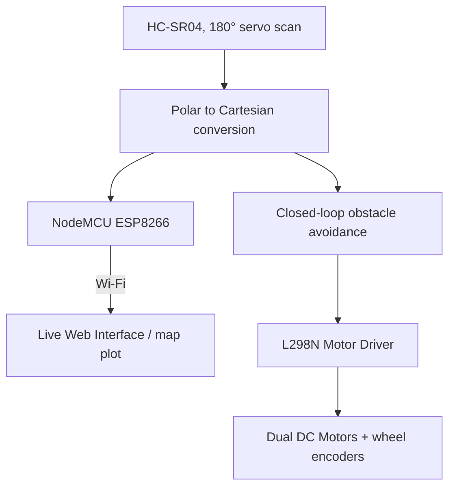

`embedded-systems` `robotics` `iot` · August 2025 · **Status: Complete**

[GitHub →](https://github.com/JubayerONROB/Ultrasonic-Obstacle-Mapping-Bot)

## Overview

A low-cost (under $50) autonomous mapping robot. An HC-SR04 ultrasonic sensor mounted on a servo performs 180° scans while a NodeMCU ESP8266 streams the resulting indoor obstacle map to a live web interface.

## Problem

Indoor obstacle mapping usually needs LiDAR or depth cameras that cost far more than a hobbyist budget allows. The goal was a working obstacle map and closed-loop avoidance for well under $50 in parts.

## Approach

A single ultrasonic sensor on a servo sweeps 180° per cycle instead of using an array of fixed sensors, trading scan speed for a large cost reduction. Each polar reading (angle, distance) is converted to Cartesian coordinates for plotting, streamed over Wi-Fi to a browser-based live map, while the same distance readings drive closed-loop obstacle avoidance locally on the bot.

## System architecture

## Tech stack

- HC-SR04 ultrasonic sensor + servo
- NodeMCU ESP8266 (Wi-Fi streaming to web UI)
- L298N motor driver, dual DC gear motors, wheel encoders

## Experiments

No standalone lab-notebook entry yet for this project — see [[work/experiments/index|Experiments]] for the ones that exist.

## Results

- Polar-to-Cartesian coordinate conversion for real-time map plotting.
- Closed-loop obstacle avoidance driven directly by the live sensor scan, with wheel encoders providing odometry feedback.
- Total hardware cost held under $50.

## Challenges

Not documented yet.

## What I learned

Not documented yet.

## Future work

Extending from a single rotating sensor to a small sensor array or SLAM-style pose tracking, so the bot can localize itself instead of mapping from a fixed position.

## Related

[[work/projects/autonomous-rescue-drone|Autonomous Rescue Drone]] — shares the autonomous-navigation theme, aerial vs. ground-based.
[[knowledge/robotics/slam|What is SLAM?]] · [[knowledge/control-systems/pid-control|PID Control]] · [[knowledge/embedded-systems/mosfet-basics|MOSFET Basics]]
