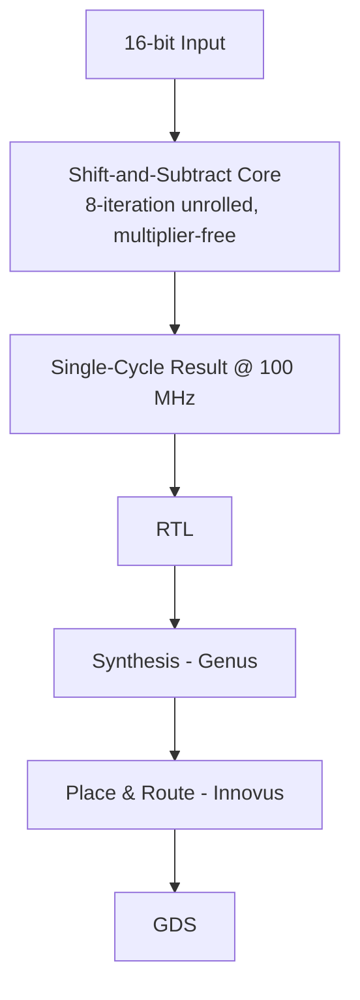

`vlsi` `verilog` `systemverilog` `cadence-eda` · Jan – Apr 2026 · **Status: Complete (EEE468, BUET)**

[GitHub →](https://github.com/JubayerONROB/vlsi-sqrt-16bit)

## Overview

A multiplier-free 16-bit integer square-root module in Verilog, using an 8-iteration unrolled shift-and-subtract algorithm — achieving single-cycle throughput at 100 MHz with 100% functional coverage.

## Problem

A hardware multiplier is expensive in area and power. A square-root unit that avoids multiplication entirely is cheaper to fabricate — the course assignment was to design one and carry it all the way through a real RTL-to-GDS flow, not just simulate the RTL.

## Approach

Implement the digit-by-digit shift-and-subtract square-root algorithm, fully unrolled across 8 iterations so the result is available one clock cycle after the input at 100 MHz, instead of an iterative multi-cycle design. Verify it with directed tests, a layered SystemVerilog testbench and functional covergroups before taking it through synthesis and place-and-route.

## System architecture

## Tech stack

- Verilog, SystemVerilog (directed, layered-SV, and covergroup testbenches)
- Cadence Genus (synthesis), Cadence Innovus (place & route)
- 45 nm GPDK045 process

## Results

| Metric | Result |
|---|---|
| Functional coverage | 100% of defined bins (input, output and cross covergroups) |
| Clock frequency | 100 MHz, result one clock cycle after input |
| Cell count (high-effort synthesis) | 197 |
| Cell area | 347 sq. µm |
| Total power (synthesis, high effort) | 17.9 µW |
| Die area after optimization | 528 sq. µm (24 µm × 22 µm) |
| Setup WNS | +0.264 ns |
| Hold WNS | +0.014 ns |
| Violating paths / DRC violations | 0 / 0 |

## Media

*EEE468 VLSI Laboratory final report, covering the design, testbenches, synthesis and place-and-route. [Read the full report (PDF, 56 pages) →](https://github.com/JubayerONROB/vlsi-sqrt-16bit/blob/main/docs/vlsi_project.pdf)*

## Challenges

Closing timing on the fully unrolled datapath: after post-route optimization the die shrank from 675 to 528 sq. µm while routing density rose from about 68% to 93.5%, and hold closed with only +0.014 ns of slack.

## What I learned

Not documented yet.

## Future work

Pipeline the design for higher throughput, extend it to 32-bit and 64-bit inputs, benchmark against Newton-Raphson and non-restoring square-root algorithms, integrate it into a larger arithmetic subsystem, and add formal verification alongside simulation and coverage.

## Related

[[work/projects/vlsi-pd-handbook|Physical Design Optimization Handbook]] — broader reference material covering the same RTL-to-GDS flow used here.
