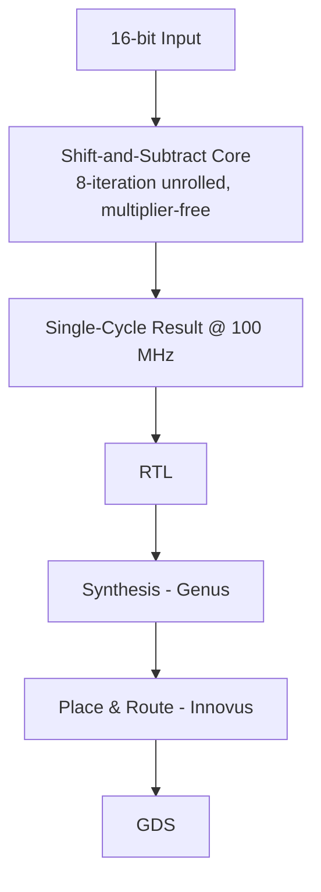

`vlsi` `verilog` `systemverilog` `cadence-eda` · Jan – Apr 2026 · **Status: Complete (EEE468, BUET)**

[GitHub →](https://github.com/JubayerONROB/vlsi-sqrt-16bit)

## Overview

A multiplier-free 16-bit integer square-root module in Verilog, using an 8-iteration unrolled shift-and-subtract algorithm — achieving single-cycle throughput at 100 MHz with 100% functional coverage.

## Problem

A hardware multiplier is expensive in area and power. A square-root unit that avoids multiplication entirely is cheaper to fabricate — the course assignment was to design one and carry it all the way through a real RTL-to-GDS flow, not just simulate the RTL.

## Approach

Implement the non-restoring shift-and-subtract square-root algorithm, fully unrolled across 8 iterations so the whole computation completes in a single clock cycle at 100 MHz instead of an iterative multi-cycle design. Verify it exhaustively with directed tests, layered SystemVerilog testbenches, and covergroups before taking it through synthesis and place-and-route.

## System architecture

## Tech stack

- Verilog, SystemVerilog (directed, layered-SV, and covergroup testbenches)
- Cadence Genus (synthesis), Cadence Innovus (place & route)
- 45 nm GPDK045 process

## Results

| Metric | Result |
|---|---|
| Functional coverage | 100% (directed + layered-SV + covergroup) |
| Clock frequency | 100 MHz, single-cycle throughput |
| Cell count | 197 |
| Area | 347 sq. µm |
| Setup WNS | +0.264 ns |
| Hold WNS | +0.014 ns |
| DRC | Clean, zero timing violations |

## Challenges

Hitting single-cycle timing at 100 MHz with a fully unrolled 8-iteration shift-and-subtract datapath required getting the combinational path clean enough to close both setup and hold with positive slack — the reported +0.264 ns setup / +0.014 ns hold margins reflect how tight that hold closure was.

## What I learned

Not documented yet.

## Future work

Not documented yet.

## Related

[[work/projects/vlsi-pd-handbook|Physical Design Optimization Handbook]] — broader reference material covering the same RTL-to-GDS flow used here.
