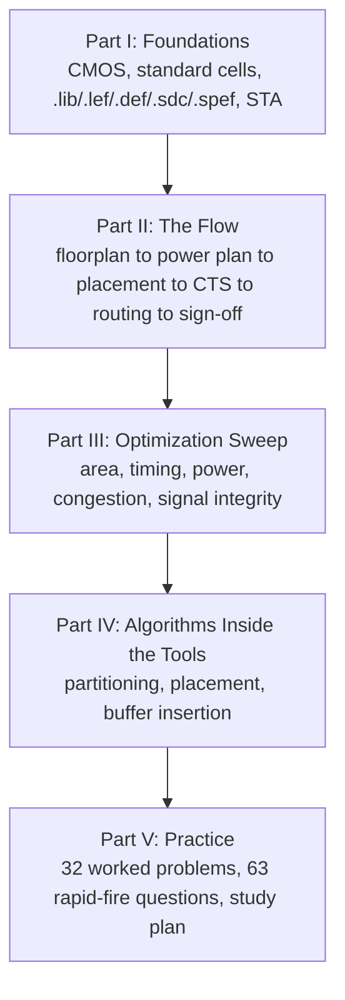

`asic` `eda` `vlsi` `physical-design` `openroad` `openlane` · **Status: Ongoing**

[GitHub →](https://github.com/JubayerONROB/physical-design-optimization-handbook)

## Overview

A complete, 135-page preparation handbook for VLSI physical design — covering theory, tool flows, and a worked problem bank. Built for interview prep, coursework, sign-off/ECO problem-solving, and hackathon reference, with derivations from first principles rather than bare assertions.

## Problem

Most physical-design reference material is either scattered across vendor documentation and academic papers, or reduced to interview flashcards with no derivation behind them. There wasn't a single reference that covered the theory, the tool flow, and a worked problem bank together.

## Approach

Write the handbook in five parts moving from foundations to practice, covering both a commercial flow (Cadence Innovus) and the open-source flow (OpenLane/OpenROAD) side by side, with real timing/power/congestion report examples rather than synthetic ones.

## System architecture

## Tech stack

- Cadence Innovus and OpenLane/OpenROAD flows, with annotated Tcl scripts
- Licensed CC BY 4.0

## Results

- 32 fully worked problems across three difficulty tiers, with solutions.
- Real timing/power/congestion report examples rather than synthetic ones.
- Covers both a commercial flow (Cadence Innovus) and the open-source flow (OpenLane/OpenROAD) side by side.

## Media

*Edition 1, open-source release: theory, algorithms, tool flows and worked problems from floorplan to sign-off. [Download the handbook (PDF) →](/attachments/projects/vlsi-pd-handbook/Physical-Design-Optimization-Handbook.pdf)*

## Challenges

Not documented yet.

## What I learned

Not documented yet.

## Future work

Not documented yet.

## Related

[[work/projects/vlsi-16bit-square-rooter|16-bit Binary Square Rooter]] — an applied RTL-to-GDS project using the same flow this handbook documents.
