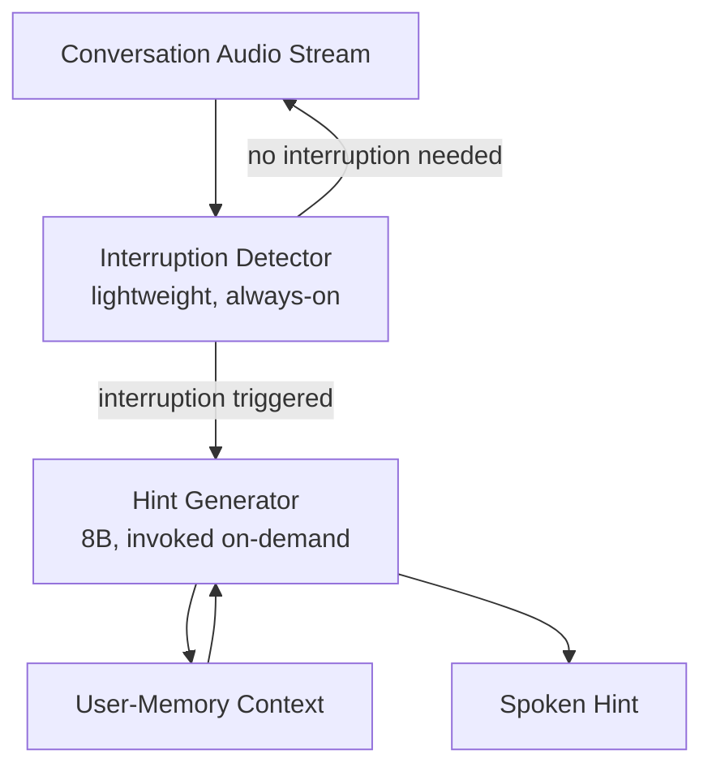

`nlp` `edge-ai` `llm` · Feb 2025 – Present · **Status: Ongoing (BSc Thesis)**

[GitHub →](https://github.com/JubayerONROB/proactive-conversation-assistant)

## Abstract

A real-time wearable assistant that decides *when* to interrupt a conversation and *what* to say, using a two-stage LLM pipeline evaluated on 28,058 decision points. The system reduces unnecessary generator calls by 7.62× and achieves up to 4.39× lower wall-clock time with an 8B generator.

## Methodology

The pipeline separates **interruption detection** (should the assistant speak now?) from **hint generation** (what should it say?), running as two stages so the expensive generator is only invoked when the cheaper detector fires. This two-stage split is what drives the call-reduction and latency gains over a single always-on generator.

## Key findings

- Persistent user-memory context is the strongest contributor to hint quality — removing it causes a **24.7-point drop in exact match**.
- A compact **1B-parameter decoder** that shares one adapter between interruption detection and response generation reduces resident weights to **1.05 GB**, with **1.3–1.8× lower compute** than the two-model pipeline — making on-device / wearable deployment realistic.

## Results

| Metric | Result |
|---|---|
| Decision points evaluated | 28,058 |
| Reduction in generator calls | 7.62× |
| Wall-clock speedup (8B generator) | up to 4.39× |
| Exact-match drop without user-memory context | 24.7 points |
| Resident weights (shared-adapter 1B decoder) | 1.05 GB |
| Compute reduction vs. two-model pipeline | 1.3–1.8× |

## Future work

Extending the shared-adapter decoder to more interruption categories and testing on-device latency on real wearable hardware.

## Related

[[work/projects/hybrid-router-vinci-monsoon|Hybrid Router: Two-Stage Local-First LLM Agent]] — similar two-stage, cost-aware routing philosophy applied to LLM task delegation.
[[notes/proactivity|Proactivity in Conversational AI]]
